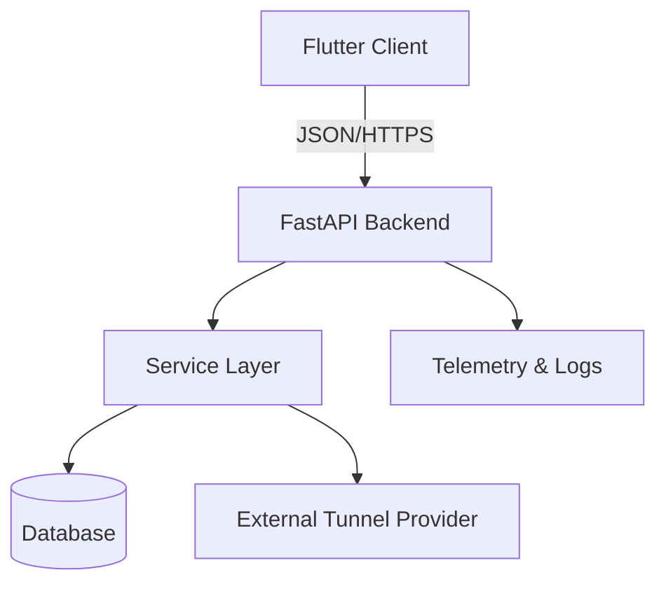

# ZerroGate

> Учебный безопасный сетевой сервис и кроссплатформенный клиент

## Описание
ZerroGate — это учебный проект, который показывает, как спроектировать и собрать связку из backend на FastAPI и кроссплатформенного Flutter-клиента. Мы фокусируемся на прозрачной архитектуре, безопасности базового уровня и удобстве кода для новичков. Проект не содержит механизмов обхода блокировок и предназначен для легальных сценариев: защита данных в публичных сетях, обучение и демонстрации.

Backend реализует REST API для управления пользователями, устройствами, профилями подключений и телеметрией. Клиентское приложение показывает статус сервера, список профилей и устройств, а также предоставляет простой интерфейс авторизации.

## Архитектура
Проект разделён на два основных блока: backend (FastAPI) и клиент (Flutter). Общение идёт через REST API. В качестве хранилища используется SQLite, а переход на PostgreSQL возможен за счёт SQLAlchemy.



## Стек технологий
- Backend: Python 3.11, FastAPI, SQLAlchemy, Pydantic, JWT (python-jose), SQLite (по умолчанию)
- Клиент: Flutter, Riverpod, Dio
- CI: GitHub Actions (pytest + линтеры легко добавить)

## Структура репозитория
- `backend/` — исходники FastAPI
- `app/` — Flutter-приложение (Android + Windows)
- `docs/` — дополнительная документация
- `.github/workflows/` — CI
- Корень: README, LICENSE, CONTRIBUTING и т.д.

## Как запустить backend
1. Установите Python 3.11+
2. Создайте виртуальное окружение и активируйте его
   ```bash
   cd backend
   python -m venv .venv
   source .venv/bin/activate
   pip install -r requirements.txt
   ```
3. Запустите dev-сервер
   ```bash
   uvicorn app.main:app --reload
   ```
4. Откройте браузер на `http://localhost:8000/docs`

## Как запустить Flutter-клиент
1. Установите Flutter (stable)
2. Установите зависимости
   ```bash
   cd app
   flutter pub get
   ```
3. Запустите
   ```bash
   flutter run -d windows # или -d linux / -d android
   ```
4. В форме логина укажите адрес backend (по умолчанию `http://localhost:8000`) и креды демо-админа `admin@zerrogate.local` / `admin`

## Для кого проект
Проект ориентирован на разработчиков, которые только начинают изучать сетевую безопасность и хотят увидеть, как связать backend и мобильный клиент. Код снабжён русскими комментариями и лаконичной архитектурой.

## План развития / Roadmap
- Добавить роли и разграничение доступа в API
- Реализовать историю подключений и статистику трафика
- Поддержка push-уведомлений о статусе устройств
- UI-экран управления профилями и устройствами
- Локализация клиента (ru/en) и темы оформления

## Скриншоты
Плейсхолдеры: добавьте сюда снимки экранов из Flutter-клиента, когда соберёте приложение.
